# Conditional Variational Auto Encoder
> 变分编码器

This is a tensorflow VAE implementation on MNIST data set, containing three networks:

1. Basic [VAE](VAE): generate digit images from random noise, could also use to remove noise or occlusion removal
2. Conditional VAE to generate digits [CVAE](CVAE_from_digits): generate digit images from certain label.
3. Conditional VAE to remove occlusion [CVAE_occlusion](CVAE_occlusion): has special decoder part to remove Image occlusion. 

## Demo

### Basic

For example, random digits generated: 

  
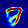  
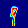  
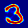  
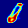
  
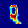  
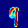 

### CVAE From Digits

Following is generated images for number 3:

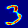
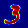
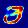
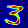
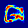
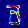
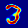

### CVAE Noise/Occlusion removal

For example:

original: 
occluded: 
infered:  (has inferred shape in the occluded area)

But it generally works not so good, using Basic VAE could even perform better, I need to experiment more on the network. 

## How to use

In each network dir, there is for example [VAE/results/save](VAE/results/save) dir. This is the saved tensorflow model, copy it to [VAE](VAE), and run `python test_generation.py`.  You will get generated images in [VAE/save](VAE/save). The other two networks are similarly used. 

